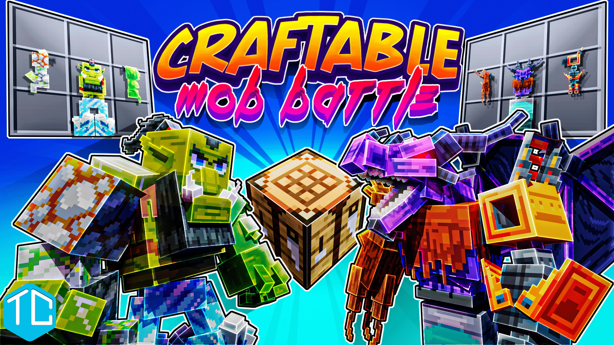
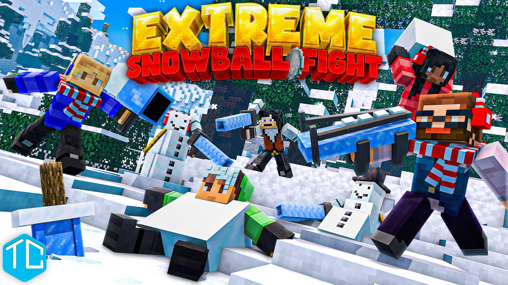

# Projects

This is a normal paragraph following a header. GitHub is a code hosting platform for version control and collaboration. It lets you and others work together on projects from anywhere.

## Craftable Mob Battle

[View on the Marketplace](https://www.minecraft.net/en-us/marketplace/pdp?id=929096a3-e531-46e5-bac9-6d13bd7efdba){:target="_blank"}

Craftable Mob Battle is a fast-paced customizable mob battle arena. Craft your best mob for battle with hundreds of possible combinations. Battle against your friends or let the bots decide your fate. Endless hours of gameplay with side missions to earn coins for fun cosmetics.

[Read More](./project_cmb.html)

## Extreme Snowball Fight

[View on the Marketplace](https://www.minecraft.net/en-us/marketplace/pdp?id=793e0379-de6b-4dcb-b7eb-d5ea3bc4ab93){:target="_blank"}

Time for the ultimate snowball fight with snowball weapons. Jump into this extreme snowball battle royal and show your friends what you are made of. Fight against each other and our special snow NPC in 3 different game modes.

[Read More](./project_esf.html)