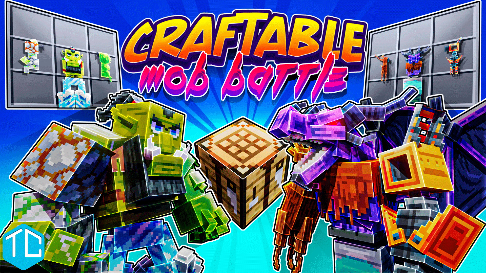

[back](./)
## Craftable Mob Battle

**Player Goal**
The aim of the map is to create custom mobs using up to 10 different mob parts. Players can choose the base mob, left and right arm and legs to design their mob for battle. Each part gives different strengths and weaknesses and different abilities. Players then can battle them against up to 3 other mobs, either created by their friend or randomly generated by the game.

**My Involvement**
I pretty much completed everything minus the core build and creating the 10 base mob models and robot helper model.

**Resource Pack**
- Setting up all entities
- Linking health molang for mobs health bar display
- Render controllers for switching model parts
- Animating and implementing animations with animation controllers
- Texturing all blocks
- Creating supporting models for blocks and decoration entities
- Adding custom sounds
- Adding custom hud_screen.json to display on screen images
- Creating custom particles
- Creating custom items and attachables
- Implementing lang files for all player facing text

**Behaviour Pack**
- Setting up custom mobs, including:
  - Ability to switch out parts (using the 3 int components prior to actor properties)
  - AI for navigation and attacking other mobs
  - Strengths and weaknesses depending on family types
  - Custom projectile and summon entities 
- Animation controllers for various gameplay mechanics
  - Right clickable items
  - Entity triggers (hit/interact)
  - Event triggers such as on death
- Animations for timed actions
- Custom decoration blocks
- Custom dialogue for NPCs
- All other entity implementations with functionality
- Gameplay functions
  - Full gameplay loop and control with functions and tick.json
- Custom items
- Loot tables
- Trade table

