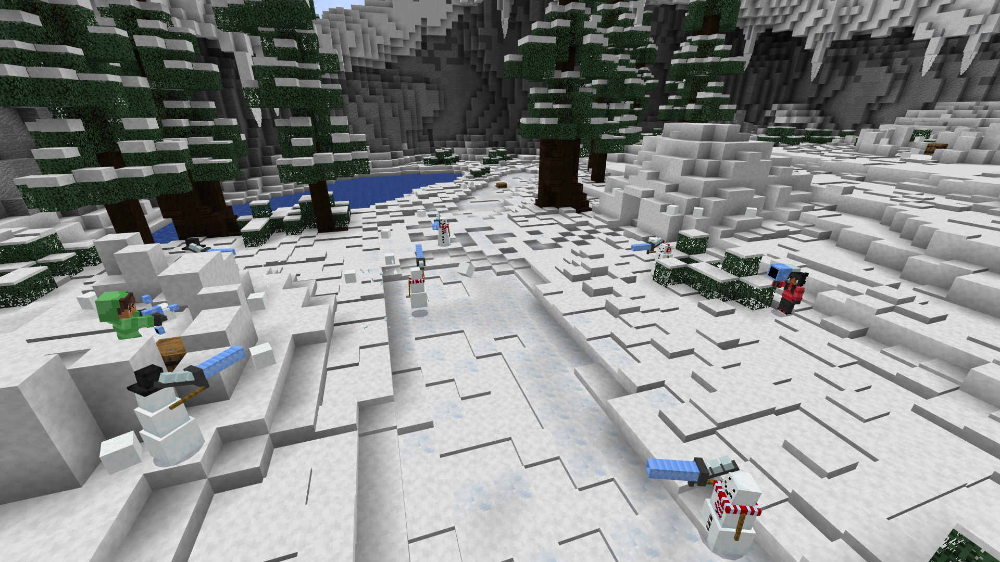
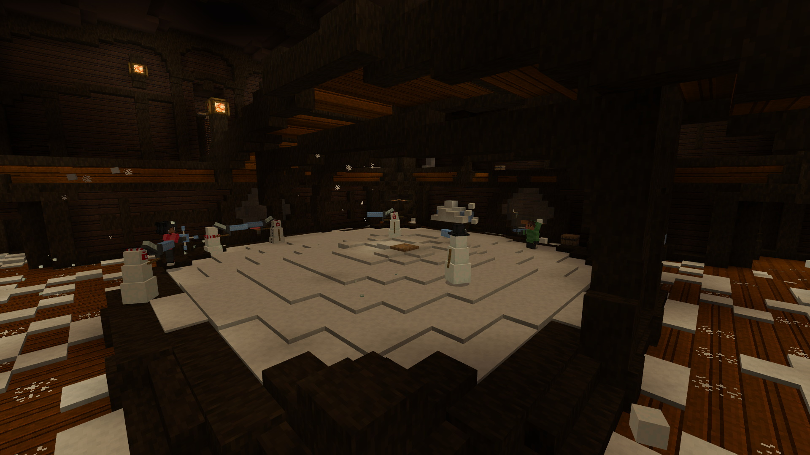
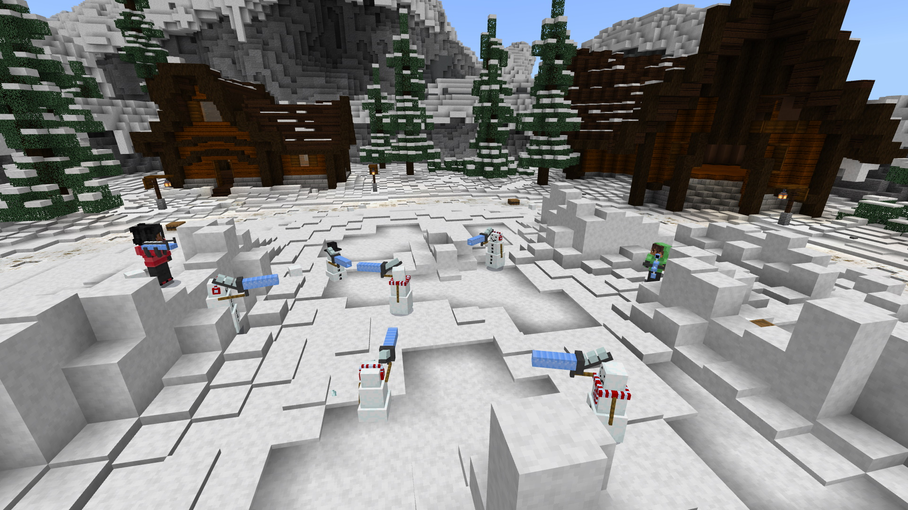
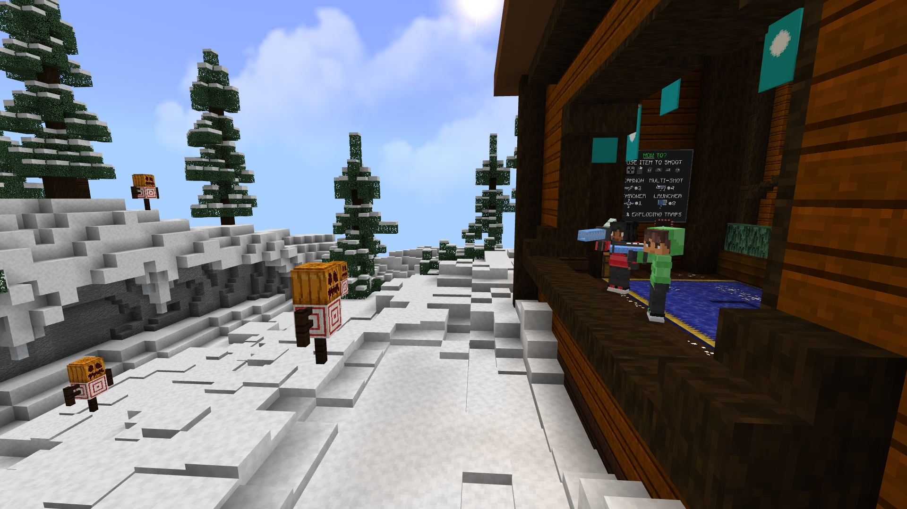
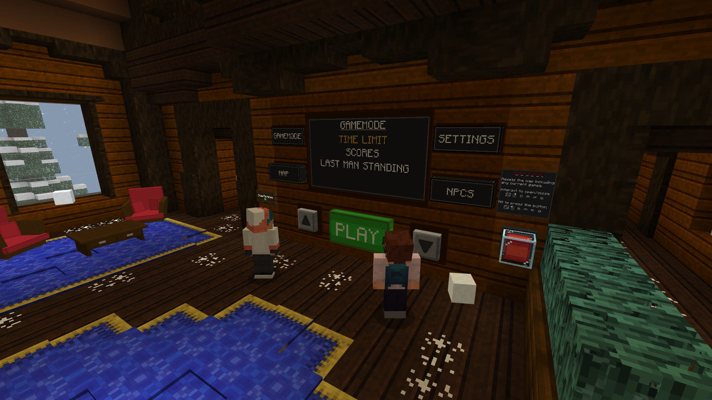

[back](./projects_maps.html)
## Extreme Snowball Fight

**Player Goal**

This was a fun small mini game map where players can fight each other in an FPS style game. With 3 different arenas to choose from players can start games with or without bots and choose different gameplay options such as lives, points to win or game timer.

**My Involvement**

All gameplay mechanics and models.

**Resource Pack**

- Animations and controllers for first person and third person attachable animations
- Entity setup for display models, interactive 3D UI and bots
- Custom fog
- Fonts for adding custom icons
- Custom items
- Custom particles
- Custom sounds

**Behaviour Pack**

- Animation controllers for various gameplay mechanics
 - Right clickable items
 - Entity triggers (hit/interact)
 - Event triggers such as on death and damage
- All other entity implementations with functionality including custom bots for players to fight
- Gameplay functions
 - Full gameplay loop and control with functions and tick.json
- Custom items
- Loot tables
- Recipies

## Images

