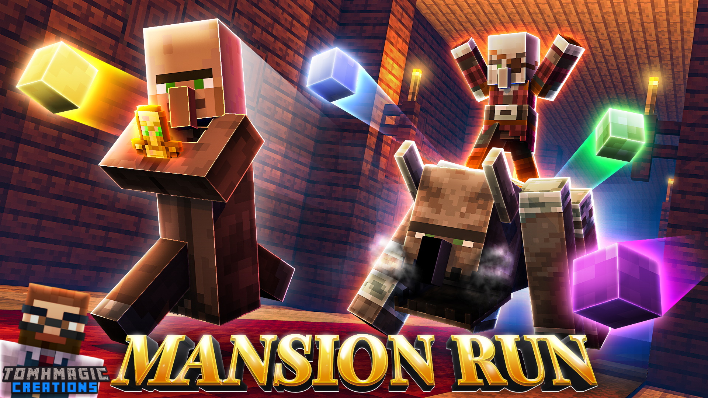
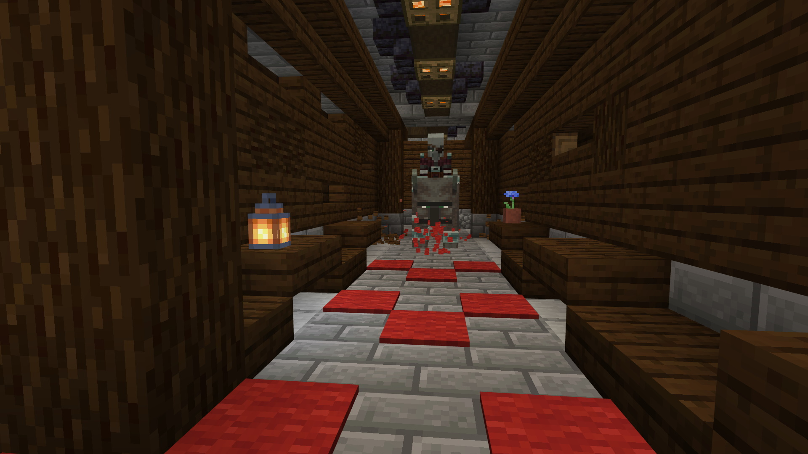
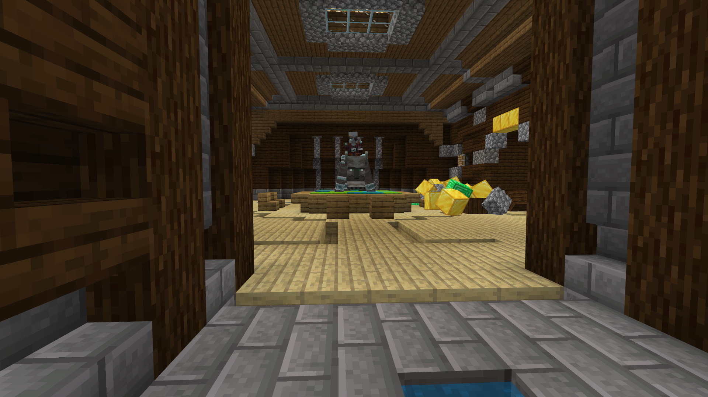
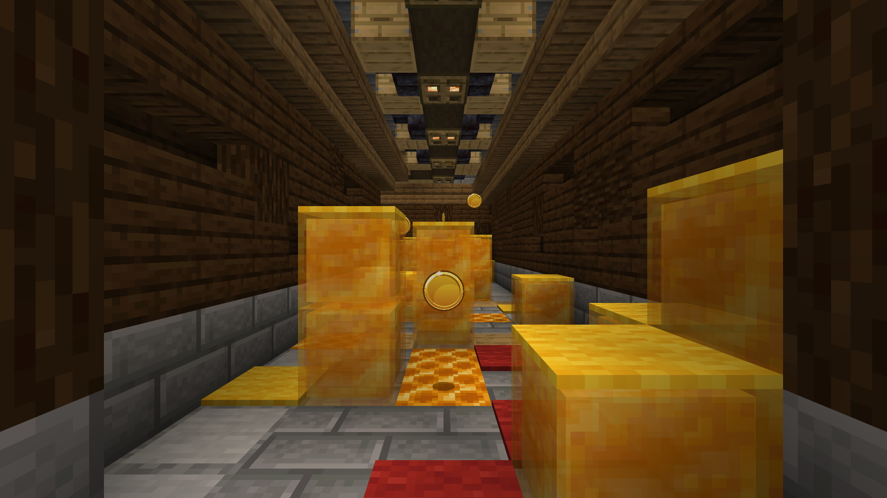
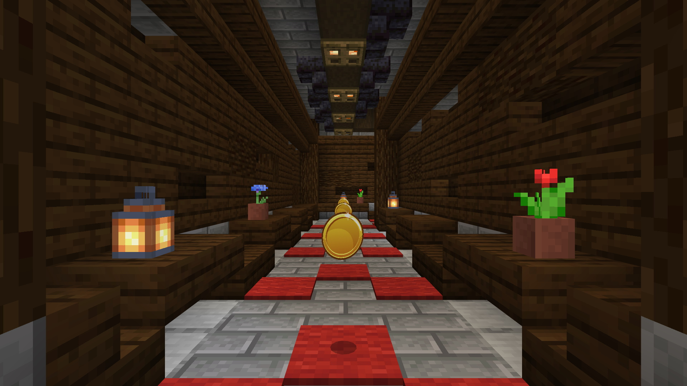
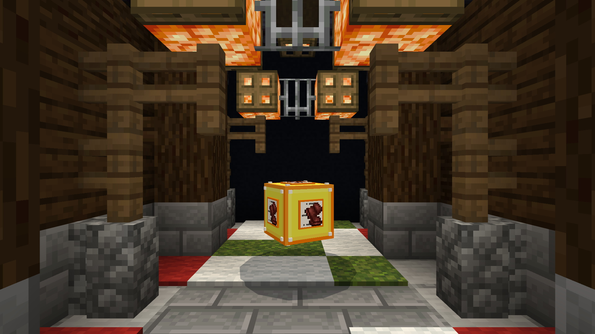

[back](./projects_maps.html)
## Mansion Run

**Player Goal**

Endless runner, players must run as long as they can collecting coins and power ups along the way. The player is chased by a hunter which keeps then running and kills them if it get’s too close. Players can also design their own rooms to be included in the random generation.

**My Involvement**

All gameplay mechanics and interactive models.

**Resource Pack**

- Entity setup for all entities including collection entities, 3D UI display and cutscene models
- Custom items
- Custom particles

**Behaviour Pack**

- Animation controllers for various gameplay mechanics
- All other entity implementations with functionality
- Gameplay functions
 - Main gameplay loop
 - Some in game command blocks
 - Random room generation

## Images

