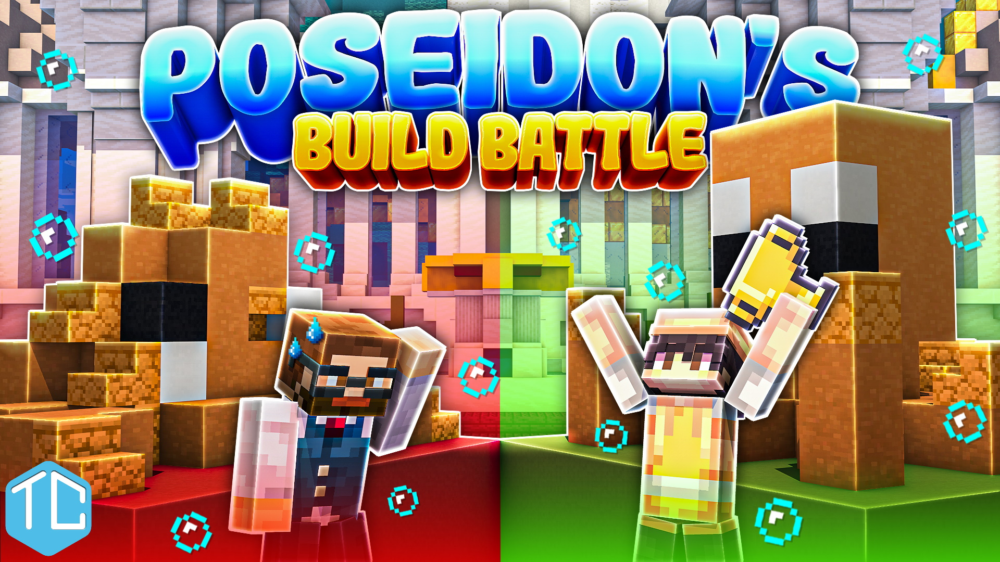
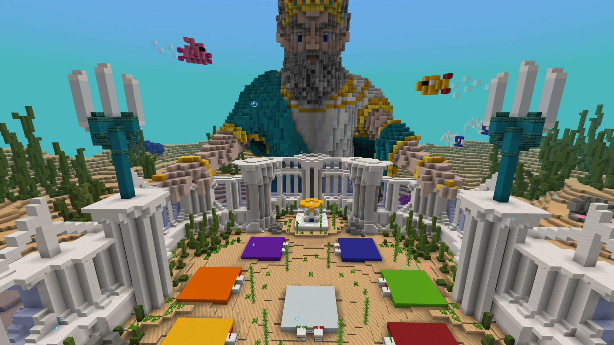
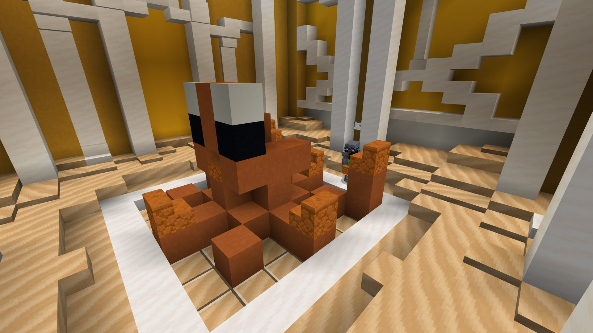
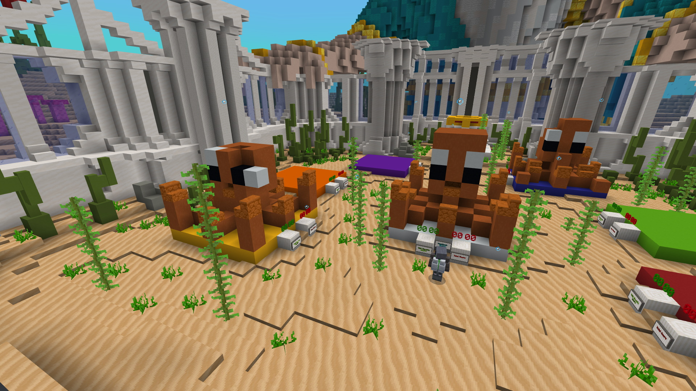
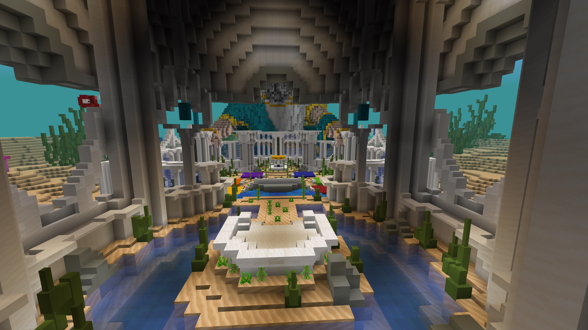

[back](./projects_maps.html)
## Poseidon's Build Battle

**Player Goal**

Players battle against each other to copy builds as close to the original as they can remember. A build is shown to the player, they are given time to look at it, then they have a time limit to recreate it with the blocks given. The points are totalled depending on their accuracy to the original build.

**My Involvement**

All gameplay mechanics and decorative models.

**Resource Pack**

- Entity setup for display models
- Custom fog
- Fonts for adding custom icons
- Custom items
- Custom particles
- Custom sounds

**Behaviour Pack**

- Animation controllers for various gameplay mechanics
- All other entity implementations with functionality
- Gameplay functions
 - Main gameplay loop and control with functions and tick.json
 - This was pre new execute, so build comparison required in game command blocks

## Images

